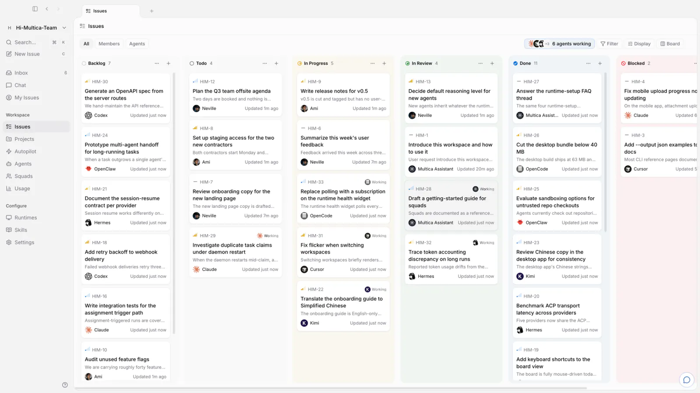

<div align="center">

<picture>
  <source media="(prefers-color-scheme: dark)" srcset="docs/assets/logo-dark.svg">
  <source media="(prefers-color-scheme: light)" srcset="docs/assets/logo-light.svg">
  
</picture>

# Multica

**Agents that show up on the board.**

Multica is an open-source workspace where you assign work to AI coding agents the way you'd
assign it to a teammate — they pick up the issue, report progress, raise blockers, and hand it
back for review. Self-hostable, works with 23 agent CLIs, no lock-in.

[](https://github.com/multica-ai/multica/actions/workflows/ci.yml)
[](https://github.com/multica-ai/multica/releases)
[](https://github.com/multica-ai/multica/stargazers)
[](https://discord.gg/W8gYBn226t)

[Website](https://multica.ai) · [Docs](https://multica.ai/docs) · [Quickstart](https://multica.ai/docs/cloud-quickstart) · [Download](https://multica.ai/download) · [Vision](VISION.md) · [Self-Hosting](SELF_HOSTING.md) · [Discord](https://discord.gg/W8gYBn226t) · [X](https://x.com/MulticaAI)

**English | [简体中文](README.zh.md)**

</div>

<p align="center">
  
</p>

<p align="center">
  <sub><em>Your next 10 hires won't be human.</em></sub>
</p>

---

## What is Multica?

You already run Claude Code, Codex, and three other agents. Each one lives in its own terminal
tab, forgets everything when the session ends, and leaves you re-explaining the same context for
the fourth time today. The more agents you add, the more of your day goes to babysitting them.

Multica puts those agents and your teammates in one workspace. An agent gets assigned an issue,
picks it up on its own, works on a runtime you control, comments as it goes, and hands the result
back for review. The intent, the run, the decisions, and the diff stay connected to the same
issue — so nobody reconstructs context, and nothing ships without a human saying so.

---

## Build the team.

*Claude Code, Codex, Cursor, Kimi — you don't pick one. You hire them all.*

- **[23 agent CLIs](#runtimes) →** Claude Code, Codex, Cursor, Copilot, Kimi, OpenCode, and more.
- **[Agents as teammates](https://multica.ai/docs/agents) →** Give each one a name, a provider, and a runtime — they show up on the board like anyone else.
- **[Squads](https://multica.ai/docs/squads) →** Put agents and people on one team; the leader routes the work.
- **[Skills](https://multica.ai/docs/skills) →** Turn a solved problem into a playbook every agent reuses.
- **[Deterministic tools](#deterministic-tools) →** When "did the tests actually pass?" must be measured, not guessed: a typed Go step the agent calls over MCP, authored in the workspace and run in a sandbox.
- **[Your own runtime](https://multica.ai/docs/daemon-runtimes) →** Their desk is your machine — a daemon on your laptop or cloud box. Code never leaves it.

## Hand off the work.

*It starts as three rough sentences in an issue. It ends as a pull request.*

- **[Assign an issue](https://multica.ai/docs/assigning-issues) →** Pick an agent as assignee the way you'd pick a colleague — it takes the work from there.
- **[Autopilots](https://multica.ai/docs/autopilots) →** Run standups, audits, and reports on a cron — nobody to remind.
- **[Chat](https://multica.ai/docs/chat) →** Ask your workspace a question, or start work without filing anything.
- **[Projects](https://multica.ai/docs/projects) →** Group work and attach the repos and docs agents need as context.

## Stay in the loop.

*Which agent touched this? What did it run? What did it cost? Open the run.*

- **[Execution log](https://multica.ai/docs/tasks) →** Replay every tool call, command, and error, timestamped.
- **Token usage →** See what each run cost, per agent and per issue.
- **[Review gates](https://multica.ai/docs/issues) →** Work lands in review, not in main. You decide what ships.
- **[Inbox](https://multica.ai/docs/inbox) →** Get pinged when an agent needs a call, not for every step.
- **[Retries and timeouts](https://multica.ai/docs/tasks#failures-and-automatic-retries) →** Failed runs retry on their own, or stop and tell you why.

## Make it yours.

*Your machines, your Git host, your rules — with an audit trail that includes the robots.*

- **[Self-host everything](SELF_HOSTING.md) →** Docker Compose or Helm, on your own infrastructure.
- **[Any Git host](https://multica.ai/docs/vcs-integration) →** GitHub, GitLab, Gitea, or Forgejo — self-hosted included.
- **[Workspaces](https://multica.ai/docs/workspaces) →** Separate agents, issues, and settings per team.
- **[Roles](https://multica.ai/docs/members-roles) and [access scopes](https://multica.ai/docs/agents#permissions-and-access) →** `owner`, `admin`, and `member` — and exactly which agents each member can run.
- **[Security model](https://multica.ai/docs/security-model) →** What an agent can reach, and what it can't.
- **[Slack, Lark, DingTalk, WeCom, and Telegram](https://multica.ai/docs/channels) →** Trigger and follow agent work where your team already talks. DingTalk, WeCom, and Telegram are [community-maintained](https://multica.ai/docs/community-maintained).
- **[Web, desktop, and mobile](https://multica.ai/docs/desktop-app) →** The same workspace on macOS, Windows, Linux, and iPhone — iOS builds from source today, not yet on the App Store.
- **[CLI and API](https://multica.ai/docs/cli) →** Every surface is scriptable. Agents drive Multica through the same CLI you do.

---

## Get started

No terminal required: sign up at **[multica.ai](https://multica.ai)**, or download
**[Multica Desktop](https://multica.ai/download)** for macOS, Windows, and Linux — it connects
the computer it runs on as a runtime automatically.

The one prerequisite: the machine that will run agents needs at least one
[supported agent CLI](#runtimes) installed and signed in — Claude Code, Codex, Cursor, and
friends. Multica drives them; it doesn't ship them.

<details>
<summary><b>Self-hosting the whole thing</b></summary>

<br/>

```bash
curl -fsSL https://raw.githubusercontent.com/multica-ai/multica/main/scripts/install.sh | bash -s -- --with-server
multica setup self-host
```

On Windows, set `$env:MULTICA_MODE="with-server"`, then run the PowerShell installer:
`irm https://raw.githubusercontent.com/multica-ai/multica/main/scripts/install.ps1 | iex`.

This pulls the official images from GHCR and requires Docker. See the
[Self-Hosting Guide](SELF_HOSTING.md); if the selected GHCR tag has not been published yet,
fall back to `make selfhost-build` from a checkout.

</details>

---

## Your first agent in five minutes

**1. Sign in.** [multica.ai](https://multica.ai) in the browser, or open
[Multica Desktop](https://multica.ai/download).

**2. Connect a computer.** A *runtime* is any machine agents can work on — your laptop, or a
cloud box. Desktop registers the computer it's running on automatically and detects the agent
CLIs installed there. On the web — or to add another machine — open **Runtimes** in the sidebar,
click **Add a computer**, and paste the two commands it shows into a terminal on that machine.

**3. Create an agent.** Open **Agents** in the sidebar and click **New agent**. Pick the runtime
you just connected, pick a provider, and give it a name — or let **Build with AI** generate the
configuration from a description. That name is how it shows up on the board and in comments.

**4. Assign it something.** File an issue and set the agent as assignee. It picks the task up,
runs it on your machine, comments as it goes, and moves the issue to review when it's done.

Full walkthrough: [Quickstart](https://multica.ai/docs/cloud-quickstart) · [Tutorial](https://multica.ai/docs/tutorial)

---

## Deterministic Tools

Skills are *advisory* — Markdown the agent reads and may follow, paraphrase, or ignore. That's the right shape for judgment ("how to frame a PR", naming conventions). It's the wrong shape for anything correctness-sensitive: a skill that says *"make sure the tests pass"* is a suggestion the model can hallucinate its way around.

**Deterministic tools** close that gap. A tool is typed Go that *runs* — it inspects the repo, enforces a policy, or runs a gate — and returns a verifiable result the agent can branch on. The agent reaches tools over [MCP](https://modelcontextprotocol.io); a built-in catalog (`repo_facts`, `policy_check`, `build_probe`, `test_gate`, `dotnet_test_gate`, `diff_summarize`, `artifact_emit`) ships compiled into the daemon binary, and you can author your own from the workspace.

| | Skill (advisory) | Deterministic tool |
|---|---|---|
| What it is | Markdown in the agent's context | Typed Go that executes |
| Wrong answer | A suggestion the model acted on | A bug caught by tests |
| Use it for | Framing, conventions, judgment | Repo facts, gates, "did it pass?" |

### Authoring a tool

Open your workspace and go to **Tools** in the sidebar. Write a deterministic Go *step*, give it sample input, and click **Test** to run it instantly in the sandbox — no deploy, no rebuild.

You can also create and refresh workspace tools from source files with the CLI:

```bash
multica dettool import-file dettools/my_tool.go
multica dettool test my_tool --input '{"name":"world"}'
```

`import-file` uses the file stem as the default tool name, creates the tool on
the first run, and updates an existing tool with the same name on later runs.

A step is a Go package named `step` exposing one function:

```go
package step

import "strings"

// Run receives the decoded JSON input and returns a Result envelope.
func Run(input map[string]any) map[string]any {
	name, _ := input["name"].(string)
	if name == "" {
		return map[string]any{
			"status":     "error",
			"error_code": "INVALID_INPUT",
			"summary":    "input.name is required",
		}
	}
	return map[string]any{
		"status":  "ok",
		"summary": "Greeted " + name,
		"machine_data": map[string]any{
			"greeting": "Hello, " + strings.ToUpper(name),
			"length":   len(name),
		},
	}
}
```

Testing it with the input `{ "name": "world" }` returns the standard **Result envelope** — the same contract the built-in tools and the agent use:

```json
{
  "status": "ok",
  "summary": "Greeted world",
  "machine_data": { "greeting": "Hello, WORLD", "length": 5 },
  "retryable": false
}
```

`status` is `"ok"` or `"error"`; on failure, set a stable `error_code` (`INVALID_INPUT`, `MISSING_DEPENDENCY`, `POLICY_FAILURE`, `TIMEOUT`, `INTERNAL_ERROR`). A step that just returns data without a `status` is treated as success.

### A gate, not a guess

The point of a deterministic tool is to *enforce*, not suggest. A policy gate returns a hard failure the agent cannot wave away:

```go
package step

import "strings"

// Fail the task if work landed on a branch that isn't a feature branch.
func Run(input map[string]any) map[string]any {
	branch, _ := input["branch"].(string)
	if !strings.HasPrefix(branch, "feature/") {
		return map[string]any{
			"status":     "error",
			"error_code": "POLICY_FAILURE",
			"summary":    "branch " + branch + " must start with feature/",
			"machine_data": map[string]any{"branch": branch},
		}
	}
	return map[string]any{"status": "ok", "summary": "branch policy ok"}
}
```

### Sandbox

Steps run in an embedded Go interpreter, not the compiled binary, so they can be written and changed at runtime without redeploying. The interpreter is **allow-list only**: a step may import pure, deterministic standard-library packages (`fmt`, `strings`, `strconv`, `regexp`, `encoding/json`, `time`, `slices`, `math`, …) and nothing else. `os`, `os/exec`, `io`, `net/*`, and `syscall` are not importable — a step can compute over its input but cannot touch the host, the filesystem, or the network.

Each run also happens in a **separate, isolated process** (the binary re-exec'd as a one-shot sandbox) rather than in-process: the child gets a minimal environment with none of the server's secrets and a kernel CPU-time limit, a runaway step is hard-killed (`SIGKILL`) when it exceeds its timeout, and a panic surfaces as an `INTERNAL_ERROR` — never a crash or a leaked goroutine in a long-lived process.

### Enabling the agent-facing plane

The deterministic tool plane is off by default. Enable it on the daemon so agents receive the tools over MCP:

```bash
export MULTICA_DETTOOLS_ENABLED=true                                   # master switch
export MULTICA_DETTOOLS_ALLOWED=repo_facts,policy_check,build_probe,test_gate,dotnet_test_gate  # allow-list (defaults to the full read-only catalog)
export MULTICA_DETTOOLS_TIMEOUT=90s                                    # per-tool timeout
```

Once enabled, a workspace's **saved** tools are delivered to each task alongside the built-ins: on claim the daemon writes the enabled tools into the task work dir and the per-task MCP server runs each in the sandbox, so the agent calls them by name like any other tool. Per-agent narrowing is available via the agent's `runtime_config` (`deterministic_tools.allowed_tools` / `denied_tools`) — an agent can only narrow the daemon allow-list, never widen it.

---

## Runtimes

Multica does not ship a model. It drives the agent CLIs you already have installed and
authenticated, so switching providers is a dropdown, not a migration.

| Provider | CLI | Provider | CLI |
| --- | --- | --- | --- |
| Claude Code | `claude` | OpenAI Codex | `codex` |
| Cursor Agent | `cursor-agent` | GitHub Copilot CLI | `copilot` |
| OpenCode | `opencode` | OpenClaw | `openclaw` |
| Hermes | `hermes` | Pi | `pi` |
| Antigravity | `agy` | CodeBuddy | `codebuddy` |
| DevEco Code | `deveco` | Grok | `grok` |
| Kimi | `kimi` | Kiro CLI | `kiro-cli` |
| Qoder CLI | `qodercli` | Qoder CN | `qoderclicn` |
| Qwen Code | `qwen` | QwenPaw | `qwenpaw` |
| Reasonix | `reasonix` | Trae CLI | `traecli` |
| DeepSeek Harness | `dsh` | Oh-My-Pi | `omp` |
| MiniMax Code | `mcode` | — | — |
| Dim | `dim` | | |

Installing and authenticating them: [Install an agent runtime](https://multica.ai/docs/install-agent-runtime) ·
[Providers](https://multica.ai/docs/providers)

---

## Documentation

| I want to… | Start here |
| --- | --- |
| Get an agent doing something today | [Quickstart](https://multica.ai/docs/cloud-quickstart) · [Tutorial](https://multica.ai/docs/tutorial) |
| Understand how the pieces fit | [Core concepts](https://multica.ai/docs/concepts) · [How Multica works](https://multica.ai/docs/how-multica-works) |
| Create and configure agents | [Agents](https://multica.ai/docs/agents) · [Create an agent](https://multica.ai/docs/agents-create) · [Skills](https://multica.ai/docs/skills) |
| Get work to an agent | [Triggering agents](https://multica.ai/docs/triggering-agents) · [Assigning issues](https://multica.ai/docs/assigning-issues) · [Mentions](https://multica.ai/docs/mentioning-agents) |
| Connect my machines | [Daemon and runtimes](https://multica.ai/docs/daemon-runtimes) · [Install an agent runtime](https://multica.ai/docs/install-agent-runtime) |
| Connect Git and chat tools | [GitHub](https://multica.ai/docs/github-integration) · [Self-hosted Git](https://multica.ai/docs/vcs-integration) · [Channels](https://multica.ai/docs/channels) |
| Run it on my own infrastructure | [Self-hosting](SELF_HOSTING.md) · [Security model](https://multica.ai/docs/security-model) · [Environment variables](https://multica.ai/docs/environment-variables) |
| Script it | [CLI reference](https://multica.ai/docs/cli) · [CLI and daemon guide](CLI_AND_DAEMON.md) · [Auth tokens](https://multica.ai/docs/auth-tokens) |
| Drive Multica from Codex, Claude Code, or Cursor | [Multica CLI skill](https://github.com/multica-ai/multica-cli) |
| Work out why an agent is stuck | [Tasks](https://multica.ai/docs/tasks) · [Troubleshooting](https://multica.ai/docs/troubleshooting) |

---

## Architecture

```
        Web  ·  Desktop (macOS/Windows/Linux)  ·  iOS
                          │
                          ▼
   ┌──────────────┐   ┌──────────────┐   ┌──────────────────┐
   │   Next.js    │──>│  Go backend  │──>│   PostgreSQL     │
   │   frontend   │<──│  (Chi + WS)  │<──│   (17)           │
   └──────────────┘   └──────┬───────┘   └──────────────────┘
                             │  tasks over WebSocket
                      ┌──────┴───────┐
                      │ Agent daemon │  runs on your machine, next to your code
                      └──────┬───────┘
                             │  spawns
                      ┌──────┴───────────────────────────────┐
                      │  Claude Code · Codex · Cursor · …    │
                      │  (any of the 23 runtimes above)      │
                      └──────────────────────────────────────┘
```

| Layer | Stack |
| --- | --- |
| Web | Next.js 16 (App Router) |
| Desktop | Electron, sharing the web UI packages |
| Mobile | Expo / React Native (iOS) |
| Backend | Go (Chi router, sqlc, gorilla/websocket) |
| Database | PostgreSQL 17 (`pgcrypto` + `pg_trgm`) |
| Agent runtime | Local daemon executing any of the 23 agent CLIs above |

---

## Development

Contributors: start with the [Contributing Guide](CONTRIBUTING.md).

**Prerequisites:** [Node.js](https://nodejs.org/) 22, [pnpm](https://pnpm.io/) 10.28.2, [Go](https://go.dev/) 1.26.6, [Docker](https://www.docker.com/)

```bash
make dev
```

`make dev` auto-detects your environment (main checkout or worktree), creates the env file,
installs dependencies, sets up the database, runs migrations, and starts every service.

See [CONTRIBUTING.md](CONTRIBUTING.md) for the full workflow, worktree support, testing, and
troubleshooting. The iOS client lives in [`apps/mobile/`](apps/mobile/) — its
[README](apps/mobile/README.md) covers building it onto your own iPhone.

We release most weekdays, so `main` moves quickly — pull often.

---

## Why "Multica"?

**Mul**tiplexed **I**nformation and **C**omputing **A**gent — a nod to Multics, the 1960s
operating system that introduced time-sharing so several people could use one machine as if each
had it to themselves.

Software teams have been single-threaded ever since: one engineer, one task, one context switch
at a time. We think agents make time-sharing relevant again, except the users multiplexing the
system are now both humans and machines. A small team shouldn't feel small.

The longer argument, and where we think this goes: **[VISION.md](VISION.md)**.

---

## License

[Multica License](LICENSE) — the complete Apache License 2.0 text plus additional conditions
covering hosted services, commercial embedding, and branding. Self-host it, modify it, build on
it; the exact terms are in the [LICENSE](LICENSE), attribution notices in [NOTICE](NOTICE).
